# ダウンロードとインストール

それでは、VIsual StudioをPCにインストールして、実際にプログラムの作成を行ってみましょう。
Visual Studioのインストールには、インターネット環境とMicrosoftアカウントが必要です。

- Microsoftアカウントは必須

    Microsoftアカウントは、Visual Studioのライセンス認証に必要です。
    無料で作成できるため、持っていない場合は作成しておきましょう。
    ライセンス認証を行わないと、30日間しかVisual Studioを使うことができません。

以下のリンクからVisual Studioのホームページを開きます。

<https://visualstudio.microsoft.com/>

VIsual Studioには複数のエディションが用意されています。
Community、Professional、Enterpriseの3種類があります。
このうち、無償で利用できるCommintyを選択します。

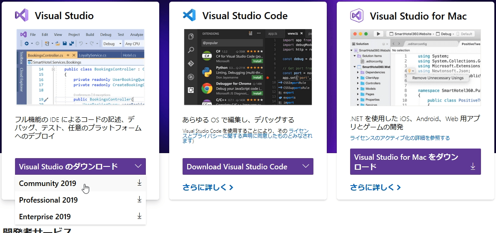

すると、Visual Studio Installerというソフトウェアのインストーラーがダウンロードされます。
これを実行して、Visual Studio Installerをインストールすると、Visual Studioの構成を選択する画面が開きます。

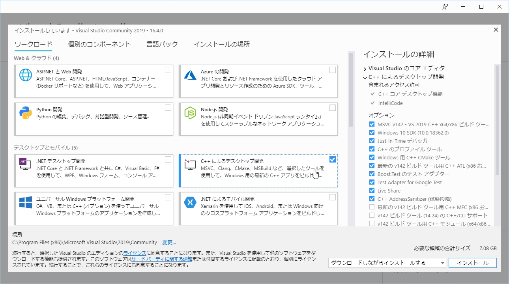

「C++ によるデスクトップ開発」を選択してチェックを入れてから「インストール」をクリックします。
Visual Studioのダウンロードとインストールが開始されるため、完了するまで待ちます。

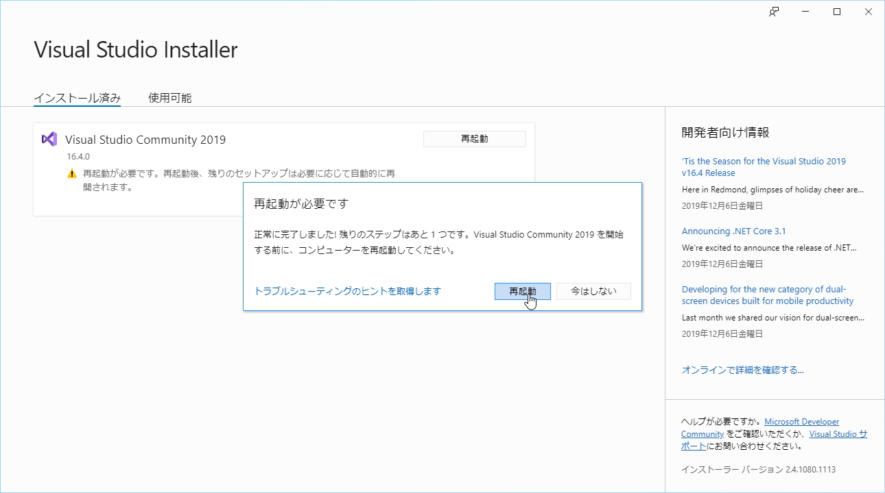

インストールが完了したら、PCを再起動します。
これでVisual Studioのインストールは完了です。

# ライセンス認証

Visual Studioを初めて起動すると、初期設定画面が開きます。

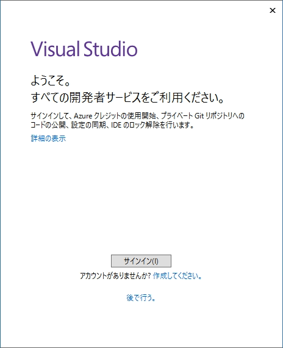

「サインイン」ボタンがあるため、これをクリックしてMicrosoftアカウントでログインします。

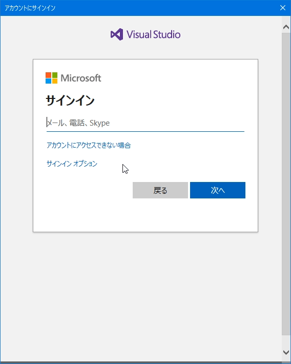

ログインに成功するとライセンス認証が完了し、配色テーマを選択する画面に切り替わります。
ここでは、何も変更せずに「Visual Studio の開始」をクリックします。

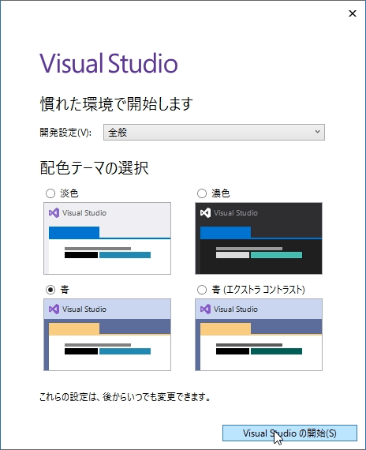

これで、Visual Studioのライセンス認証は完了です。

# プロジェクトの作成

Visual Studioを起動すると、以下のようにプロジェクトの新規作成画面が表示されます。
プロジェクトを作成する際は「新しいプロジェクト」を選択します。

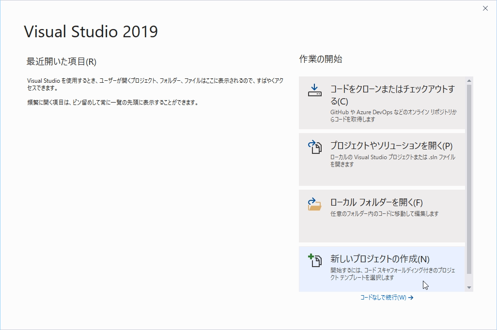

次に「空のプロジェクト」を選択して「次へ」をクリックします。

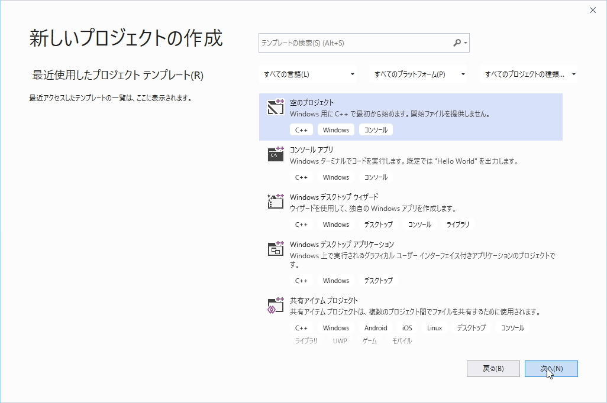

プロジェクトの名前と保存場所を決めて「作成」をクリックします。

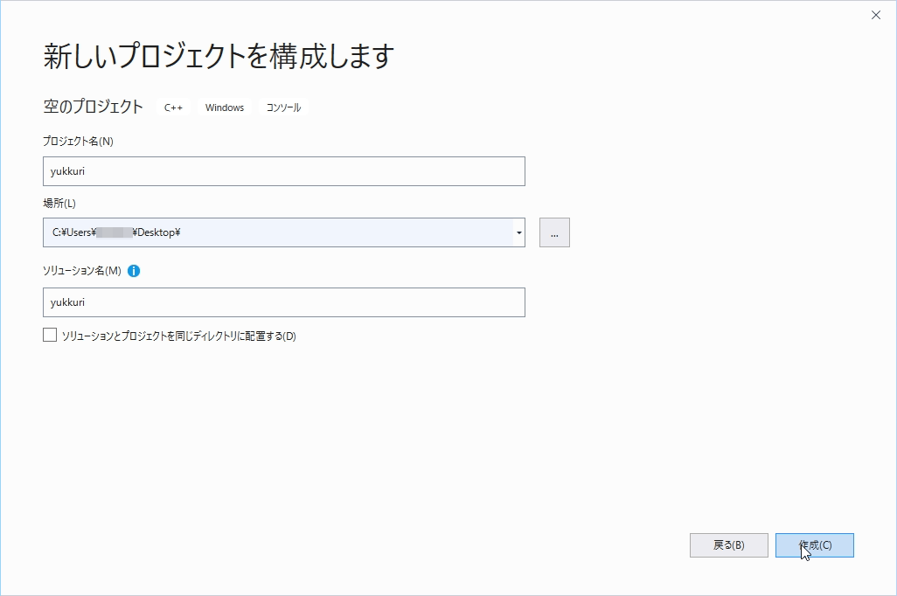

プロジェクトの作成が完了すると、Visual Studioの画面が開きます。

# ソースコードの作成

Visual Studioの画面内には「ソリューションエクスプローラー」という画面があります。
ここで、ソースコードの追加や変更、削除を行います。

- ソリューションエクスプローラーが見つからないときは

    ソリューションエクスプローラーが見つからない場合は、Visual Studioのメニューバーの「表示」->「ソリューションエクスプローラー」を選択することで再表示することができます。

ソリューションエクスプローラーの「ソースファイル」を右クリックして
「追加」->「新しい項目」の順に選択してクリックします。

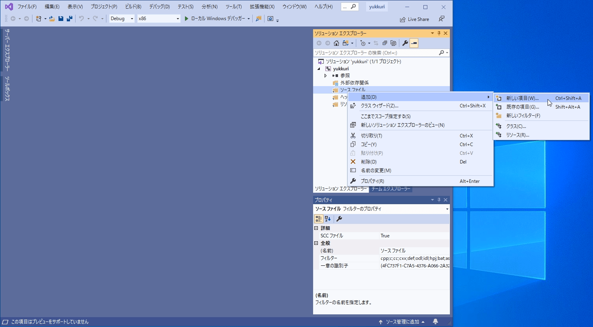

すると「新しい項目の追加」のウインドウが表示されるため、ここで追加したいファイル名を指定します。
ファイル名は、半角文字であれば任意に決められます。
拡張子は「cpp」であることに注意しましょう。
今回は「main.cpp」とします。

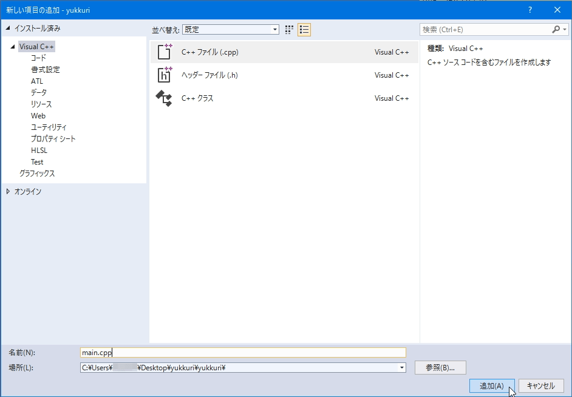

「追加」をクリックすると、ソリューションエクスプローラーにソースコードが追加され、Visual studio のコードエディタに追加したソースコードが自動的に開かれます。

- ソリューションエクスプローラーからソースコードを手動で開く

    追加したソースコードが自動的に開かれなかった場合や、ソースコードを手動で開きたい場合は、ソリューションエクスプローラーで、ソースコードのファイルをダブルクリックして開きます。

それでは、main.cppに以下のテキストを入力してみましょう。

- main.cpp
    ```
    int main() {
        return 0;
    }

    ```

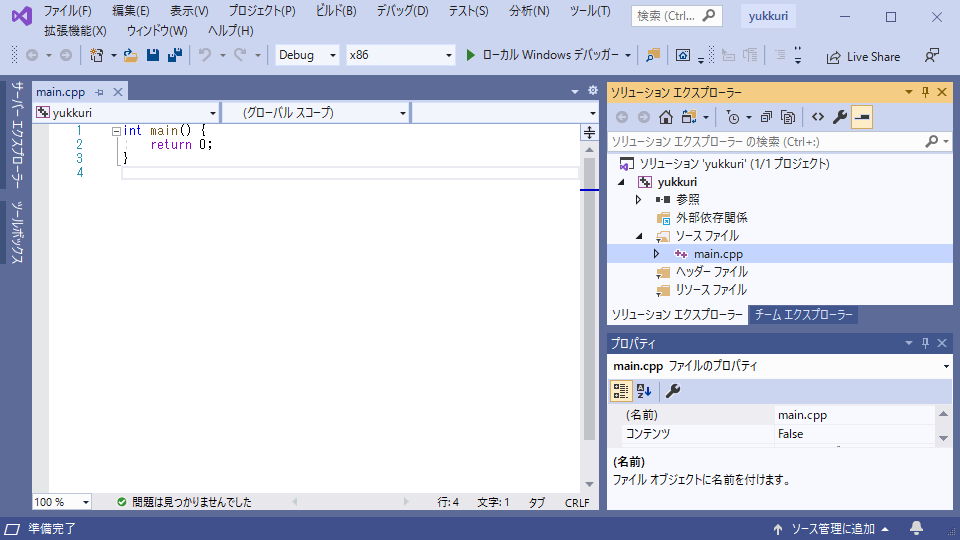

テキストを入力する際、以下の点に注意しましょう。

- 半角文字で入力します（全角文字で入力しないでください）
- ()や{}を閉じ忘れないようにしてください
- 数字の0と大文字のOを間違えないようにしてください
- 大文字と小文字は区別されます（例えばmainをMAINと入力しないでください）
- 一番最後の行は必ず空行にしてください

# ビルドと実行

ソースコードを入力し終えたら「ビルド」を行って、コンパイルとリンクを行いましょう。
Visual Studioのメニューバーから「ビルド」->「（ソリューション名）のビルド」を選択してビルドを行います。

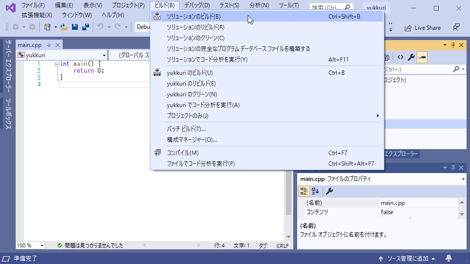

すると、Visual Stidioの「出力」という画面にビルドの実行結果が表示されます。
特に間違いがなければ「ビルド: 1 正常終了」と表示され、ビルドに成功します。

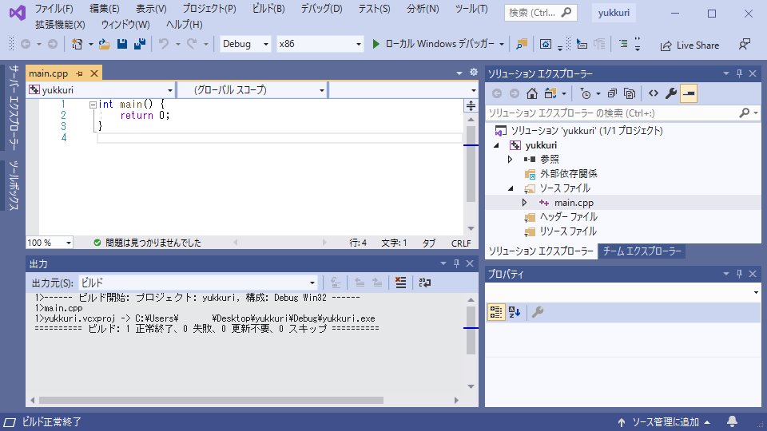

ビルドに成功したら、いよいよ作成したプログラムを実行してみましょう。
Visual Studioのメニューバーから「デバッグ」->「デバッグなしで開始」を選択すると、プログラムが実行されます。

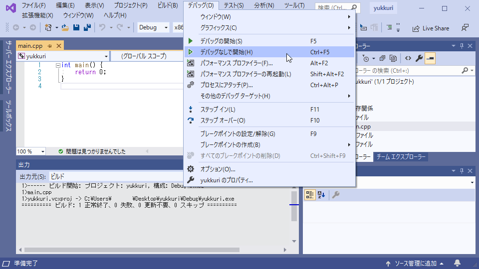

黒い画面（コマンドプロンプト）が表示されれば、実行に成功です。

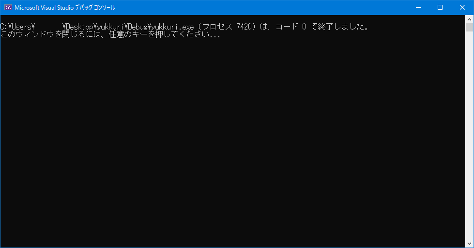

任意のキーを押すと、ウインドウが閉じます。

# プロジェクトの再開

作成したプロジェクトのフォルダの中身を見ると、名前がプロジェクト名で拡張子がslnのファイルが保存されています。
このファイルを「ソリューションファイル」と呼びます。

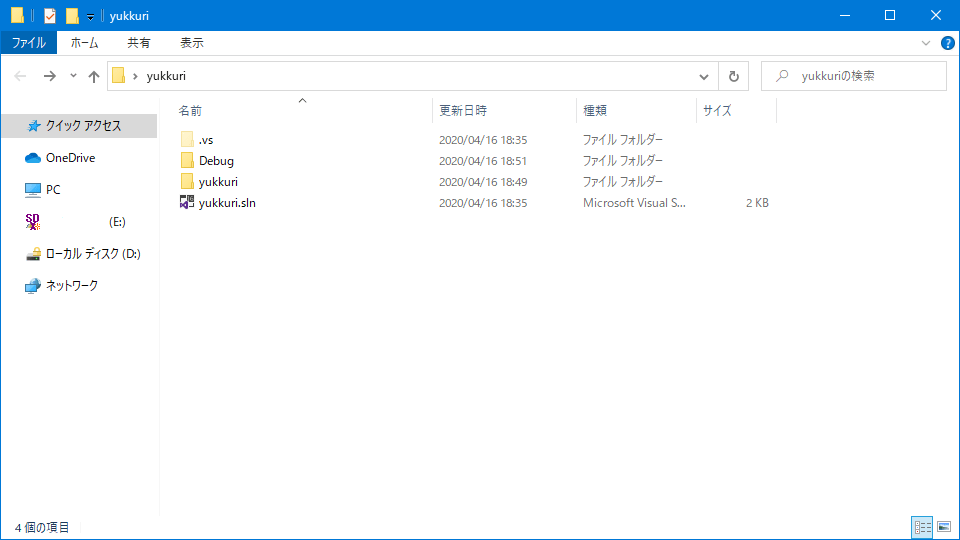

- 拡張子が表示されていない場合は

    もし、拡張子が表示されていない場合は、Windowsエクスプローラーのフォルダオプションから「表示」タブを開き、「登録されている拡張子は表示しない」のチェックを外して、変更を適用しましょう。

    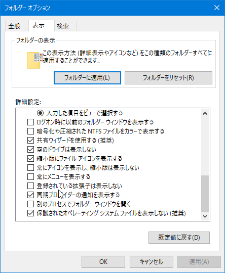

ソリューションファイルをダブルクリックして開くと、Visual Studioが開き最後にプロジェクトが保存された状態に復帰します。
ただし、同じプロジェクトを二重に開くことはできません。
